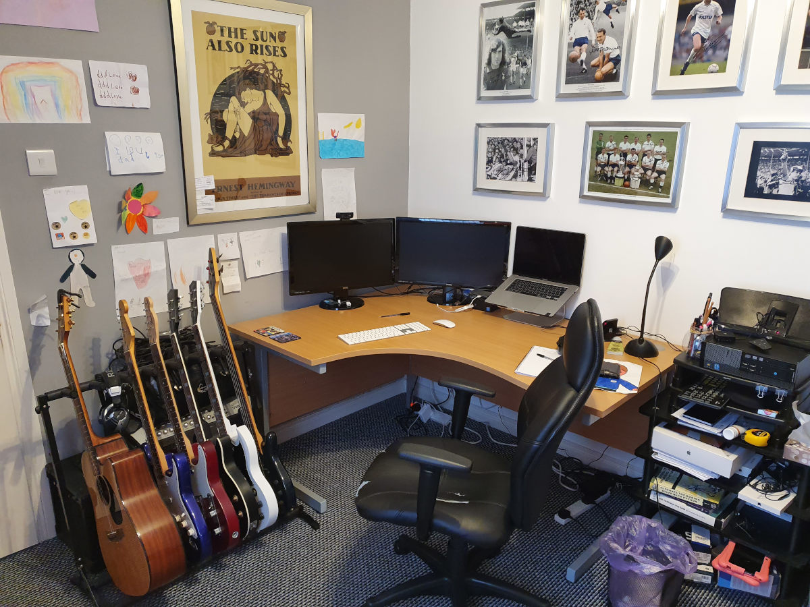

*(All of these are for my own personal use, things vary greatly for my work at Zapier. I'm not gear obsessed and frequently make do with older tech if it gets me by.)*

## Hardware

Dell Optiplex i5-3470 7010 SFF 3rd Gen Quad Core - 20GB RAM

2 x BenQ GL2450HM LED 24-inch monitors

Logitech keyboard and mouse

Samsung Xpress M20226W Laser Printer

## Software

### Operating System

Windows 10 (I still prefer Windows 7)

Ubuntu 20 (mainly for web dev in Gatsby)

### Packages

VS Code

[Adobe Photoshop](https://www.adobe.com/uk/products/photoshop.html)

[GIMP](https://www.gimp.org)

Brave

Firefox

Google Chrome

[Gatsby JS](https://www.gatsbyjs.org)

## Services

[Dropbox](https://www.dropbox.com/)

[GSuite](https://gsuite.google.com)

[Gocardless](https://gocardless.com/)

[Paypal](https://www.paypal.com/)

[Github](https://github.com/)

[Netlify](https://netlify.com/)

[1Password](https://1password.com)

[Mailchimp](https://mailchimp.com)

## Other useful things

Notebooks, lots of them.

Staedtler Stick 430M black pens. I'll make do with other ones if there is nothing else but I prefer these ones and have for twenty odd years.